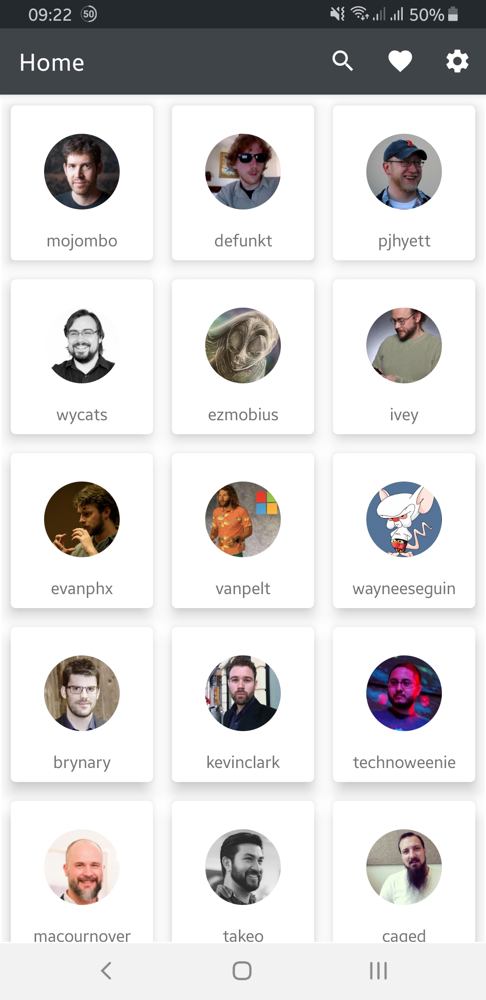
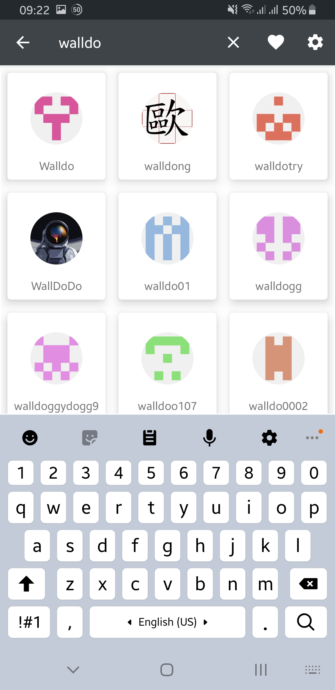
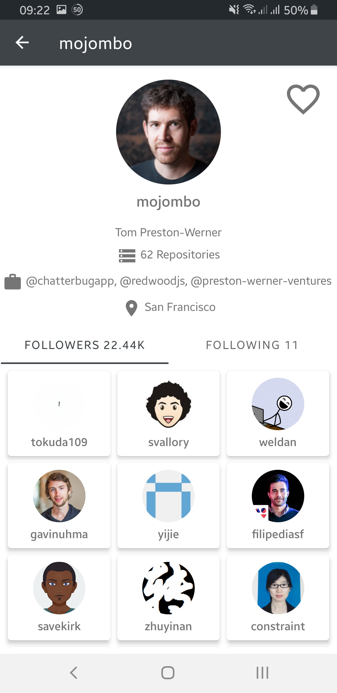
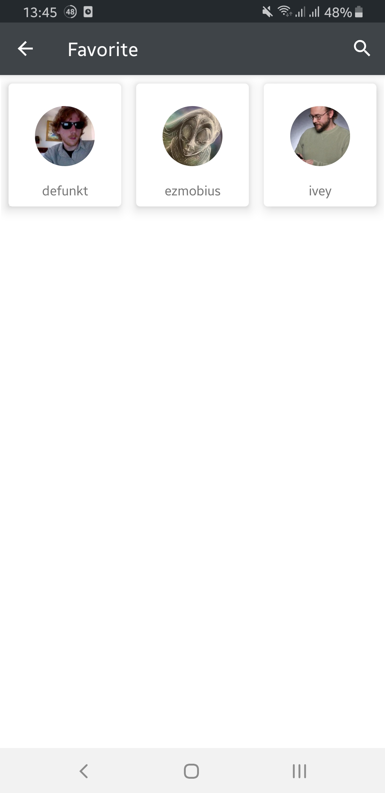

# GithubUser
 A GitHub user API consumer App as a Final Assignment in Android Fundamental Class by dicoding.
 
 This app shows users from GitHub
 
 
 
 Tap "magnifier button" and enter keyword to search
 
 
 
 Tap one of the cards to show more informations
 
 
 
 In detail page each user can be added to favorite by tapping the "hoolow heart button" and can be accessed throught favorite menu by tapping the "full heart button"
 
 
